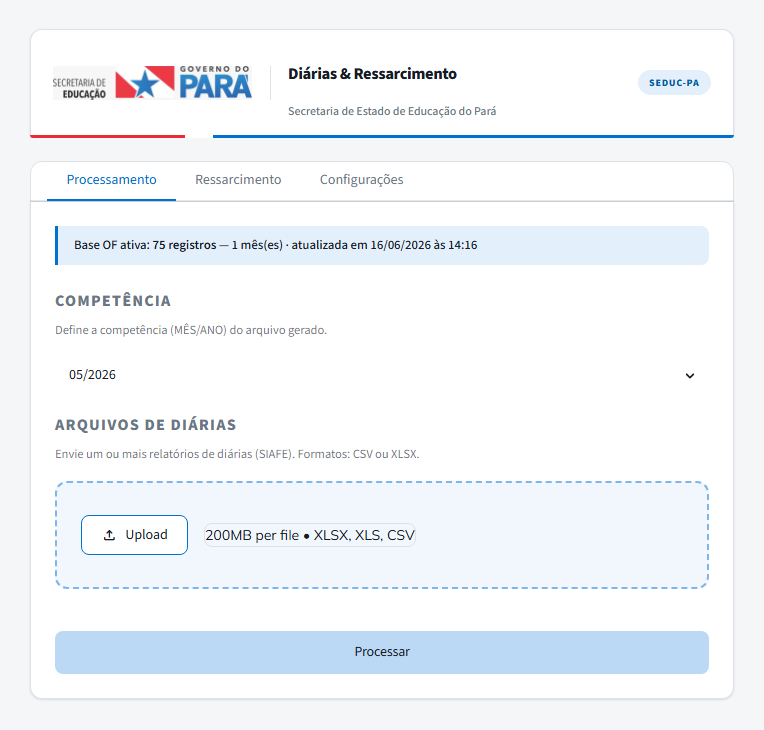
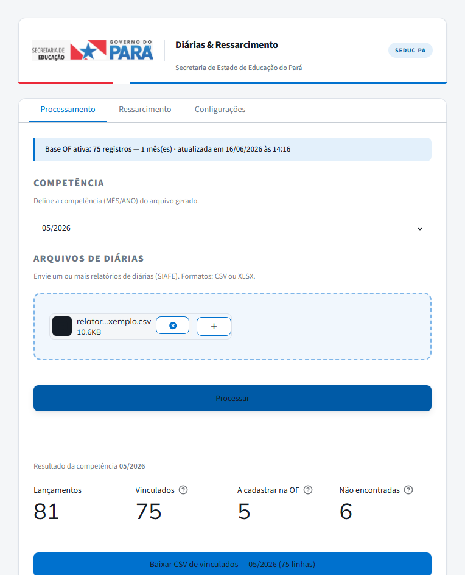

# Cruzamento de Diárias — SAPF/SEDUC-PA


Aplicação web interna da Secretaria de Estado de Educação do Pará para a rotina
**mensal** de conferência de pagamentos de **diárias**. Cada Ordem Bancária (OB) é
vinculada à **matrícula e vínculo corretos** do servidor e o sistema gera o CSV
mensal para importação no **ERGON** — substituindo uma conferência manual.

> **Aplicação real, em produção.** Este repositório é uma versão de portfólio:
> roda com **dados 100% fictícios** (`exemplos/`). Nenhum dado real de servidor é
> versionado.

## Demonstração

> Imagens geradas a partir de **dados fictícios**. Nenhum dado real.

**Processamento** — base OF carregada e seleção de competência:



**Resultado do cruzamento** — vinculados (por OB/CPF), a cadastrar na OF e não encontradas:



## O problema que resolve

Um servidor pode ter **mais de um vínculo**. Cruzar a diária apenas pelo **CPF**
é ambíguo — o CPF identifica a pessoa, não sob qual vínculo o pagamento foi feito.
A solução cruza pela **OB** contra a **base OF** (que registra o vínculo
efetivamente pago), com *fallback* inteligente por CPF.

## Como funciona

1. **Base OF** (aba Configurações): registra, por OB, a matrícula/vínculo
   efetivamente pagos (export do tipo `PRDs_OBs`).
2. **Processamento**: sobe-se um ou mais relatórios de diárias do SIAFE e escolhe-se
   a competência. O cruzamento é **híbrido**:
   - casa por **OB** (exato, por pagamento) — normalizando o formato
     (`2026160101OB09096` → `2026OB09096`);
   - se a OB ainda não está na OF, **infere por CPF** (não ambíguo: na OF cada CPF
     tem um único vínculo);
   - se nem o CPF está na OF, fica como **não encontrada**.
3. **Três saídas**, cada uma com seu download:
   | Saída | Conteúdo | Destino |
   |---|---|---|
   | **Vinculados** | tudo com matrícula/vínculo (coluna `ORIGEM` = OB ou CPF) | importação no ERGON |
   | **A cadastrar na OF** | OBs ausentes da OF, com vínculo provável por CPF | time de cadastro |
   | **Não encontradas** | sem matrícula/vínculo (CPF ausente da OF) | investigação |

Regras automáticas: descarta `ANULADO`/`REJEITADA`, descarta valores negativos
(estornos) e deduplica por OB.

## Estrutura (abas)

| Aba | Função |
|---|---|
| **Processamento** | Upload das diárias + cruzamento OF + geração dos 3 CSVs |
| **Ressarcimento** | Filtra relatório de ressarcimento do SIAFE — bot Selenium consulta cada OB e captura a descrição (classifica "diária") |
| **Configurações** | Atualiza a base OF |

## Como rodar (demo com dados fictícios)

```bash
pip install -r requirements.txt

# 1) gere os dados de exemplo (nenhum dado real)
python exemplos/gerar_dados_fake.py

# 2) suba o app
streamlit run webapp/app.py --server.port 8501
```

No app (http://localhost:8501):
1. **Configurações** → envie `exemplos/base_of_exemplo.csv`.
2. **Processamento** → competência **05/2026** → suba
   `exemplos/relatorio_diarias_exemplo.csv` → **Processar**.

O conjunto fictício já inclui casos de **vínculo por OB**, **vínculo inferido por
CPF**, **OB não encontrada**, linhas **ANULADO** e um **estorno** (valor negativo),
para exercitar todos os caminhos.

### Bot SIAFE (aba Ressarcimento)

O bot usa **Selenium** e exige acesso autenticado ao SIAFE — funciona apenas em
estação local (Windows) com o **`chromedriver.exe`** (compatível com seu Chrome)
em `consultasiafe/`. As credenciais do SIAFE são informadas em tela e **nunca são
gravadas em disco** (trafegam só por variável de ambiente para o processo do bot).
Em servidor *headless* essa aba é desativada automaticamente.

## Stack & arquitetura

- **Python 3.12 + Streamlit** (interface web)
- **openpyxl** (leitura de XLSX) · **pandas** (tabelas na UI) · **Selenium** (bot SIAFE)
- Identidade visual baseada no **SEDUC-PA Design System** (Azul Pará `#0071CE`,
  Mulish + Roboto Mono, cabeçalho institucional).

```
webapp/
├── app.py      ← interface (abas Processamento / Ressarcimento / Configurações)
├── core.py     ← regra de negócio: leitura, normalização de OB, cruzamento híbrido
├── assets/     ← logo institucional
└── data/       ← base OF persistida (gitignored — gerada em runtime)
consultasiafe/
└── bot_ressarcimento.py   ← bot Selenium (login + navegação no frameset do SIAFE)
exemplos/
└── gerar_dados_fake.py    ← gerador de dados fictícios para demonstração
```

A lógica fica em `core.py` (Python puro, sem Streamlit), o que facilita uma futura
migração da casca para outra stack (ex.: integração ao portal SIMF).

---

<sub>Sistema desenvolvido para a SAPF/SEDUC-PA. Versão de portfólio com dados
fictícios — nenhum dado pessoal real é distribuído neste repositório.</sub>
